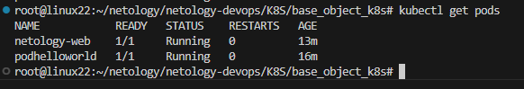
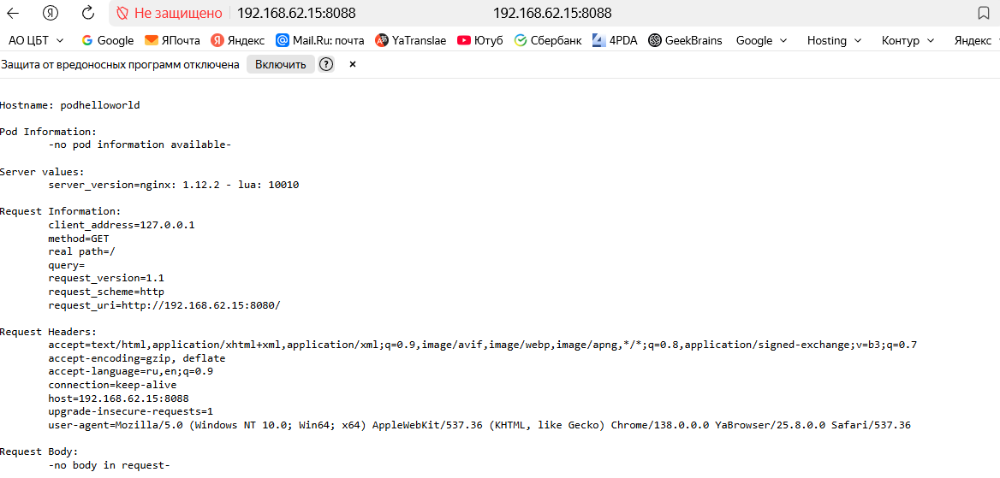
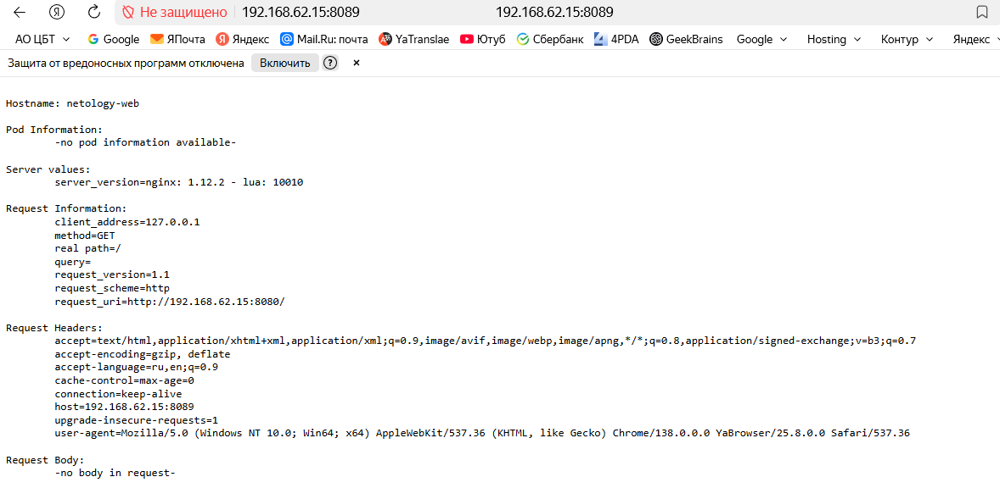

### Результат команды kubectl get pods

### Результат подключения к поду hello-world

### Результат подключения к сервису netology-svc

### Ссылким на манифесты

[Ссылка на манифест пода](pod_hello_world.yaml)

[Ссылка на манифест пода2](pod_netology-web.yaml)

[Ссылка на манифест сервиса](netology-svc.yaml)