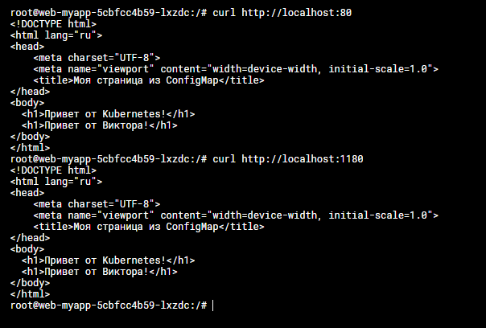
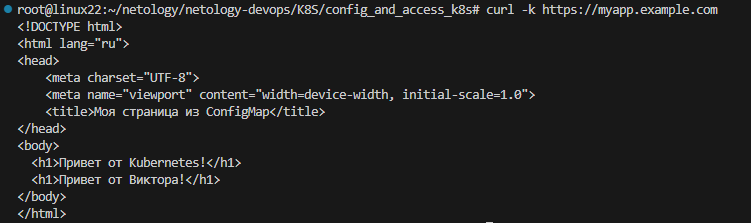
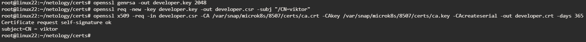
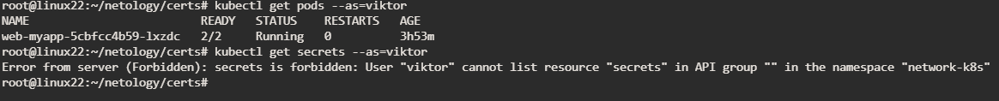

# Задание 1 Работа с ConfigMaps
**Скриншот вывода curl**

[манифест deployment](deployment.yaml)

[манифест configmap](configmap-web.yaml)

# Задание 2 Настройка HTTPS с Secrets

[манифест tls-secrets](tls-secrets.yaml)

[манифест ingress-tls](ingress.yaml)

**Скрин вывода curl -k**

# Задание 3 Настройка RBAC

[манифест role](role-pod-reader.yaml)

[манифест rolebinding](rolebinding-developer.yaml)

**Команды генерации сертификатов**

**Скриншот проверки прав**

