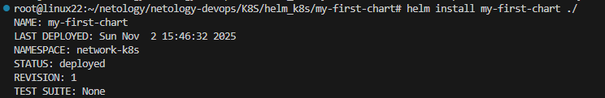
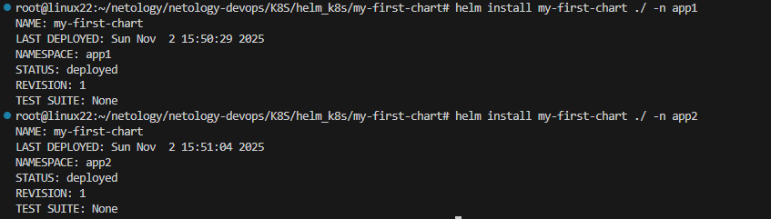
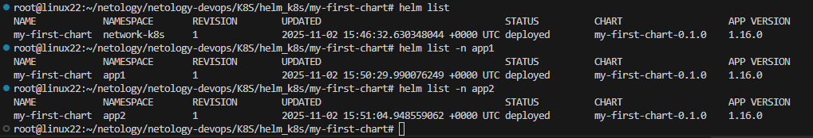

# Задание 1 Подготовить Helm-чарт для приложения
**Скриншот установки чарта в текущий ns**



[общий манифест](app_render.yaml)

**вывод команды создания ns**

```
root@linux22:~/netology/netology-devops/K8S/helm_k8s/my-first-chart# kubectl create namespace app1
namespace/app1 created
root@linux22:~/netology/netology-devops/K8S/helm_k8s/my-first-chart# kubectl create namespace app2
namespace/app2 created
```

# Задание 2 Запустить две версии в разных неймспейсах

**Скрин установки чарта в остальные ns**



**Скрин команды helm list**


