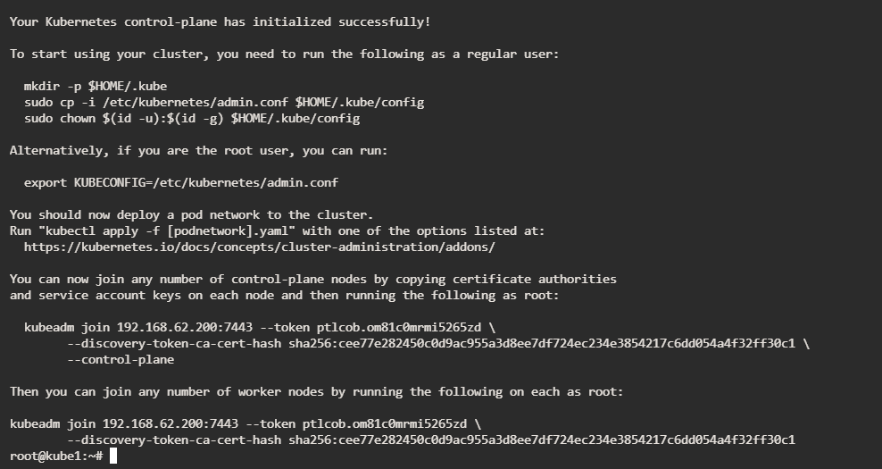
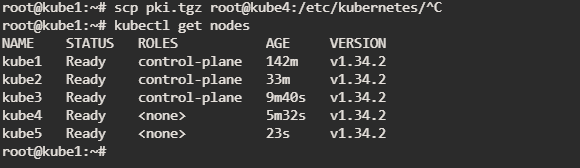
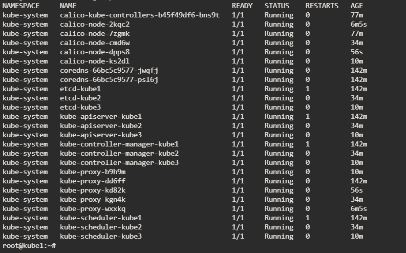

# Установка HA кластера kubernetes через kubeadm

В сценарии 5 ВМ на Ubuntu 22 serve 2cpu/2gb

Использовал версии 

<pre>
kubernetes v1.34.2
</pre>
<pre>
kubeadm v1.34.2
</pre>
<pre>
kubelet v1.34.2
</pre>
<pre>
kubectl
    Client Version: v1.34.2
    Kustomize Version: v5.7.1
    Server Version: v1.34.2
</pre>
<pre>
runc version 1.3.3-0ubuntu1~22.04.2
spec: 1.2.1
go: go1.23.1
libseccomp: 2.5.3
</pre>
<pre>
containerd v2.2.0
</pre>

### Подготовка виртуалок


**🚨 ВАЖНО!**  

ВМ не должны быть клонированы, на всех ВМ должен быть уникальный mac и uuid

На каждой ВМ надо сделать следующие действия

1. добавляем в /etc/hosts все ВМ кластера
    ```
    192.168.62.22 kube1
    192.168.62.25 kube2
    192.168.62.28 kube3
    192.168.62.27 kube4
    192.168.62.26 kube5
    ```
2. Установить chrony и синхронизировать время
3. Отключаем файрвол и selinux (RedHat OS)
4. Отключаем swap 
    ```
    swapoff -a
    ```
    коментируем строку swap в /etc/fstab , чтоб свап не включался после ребута
5. Включаем форвард трафика
    ```
    echo 'net.ipv4.ip_forward = 1' >> /etc/sysctl.conf
    ```
    применяем конфигурацию
    ```
    sudo sysctl -p
    ```
6. Устанавливаем containerd и runc
    ```
    sudo apt update
    sudo apt install -y containerd runc
    sudo systemctl enable --now containerd
    ```
    (опционально) Лучше установить руками по инструкции [тут](https://kubernetes.io/docs/setup/production-environment/container-runtimes/#containerd) 


7. Создаем дефолтный конфиг
    ```
    containerd config default > /etc/containerd/config.toml
    ```
    в созданом конфиге /etc/containerd/config.toml правим строку 
    SystemdCgroup = true
8. Устанавливаем kubeadm, kubelet and kubectl
    ```
    sudo apt-get update
    sudo apt-get install -y apt-transport-https ca-certificates curl gpg
    ```
    ```
    curl -fsSL https://pkgs.k8s.io/core:/stable:/v1.34/deb/Release.key | sudo gpg --dearmor -o /etc/apt/keyrings/kubernetes-apt-keyring.gpg
    ```
    ```
    echo 'deb [signed-by=/etc/apt/keyrings/kubernetes-apt-keyring.gpg] https://pkgs.k8s.io/core:/stable:/v1.34/deb/ /' | sudo tee /etc/apt/sources.list.d/kubernetes.list
    ```
    ```
    sudo apt-get update
    sudo apt-get install -y kubelet kubeadm kubectl
    sudo apt-mark hold kubelet kubeadm kubectl
    ```
## Настройка мастер нод

Мастер нод должно быть не четное количество , соотношение количество мастеров и воркеров можно найти интернете.

1. На 3 нодах, которые будут мастерами устанавливаем haproxy и keepalived

    ```
    apt install -y keepalived haproxy
    ```
2. Делаем конфиги keepalived

    На первой мастер ноде кластера, где будет располагаться мастер keepalived, отредактируем файл /etc/keepalived/keepalived.conf
    ```
    vrrp_script chk_haproxy {
    script "killall -0 haproxy" # check the haproxy process
    interval 2                  # every 2 seconds
    weight 2                    # add 2 points if OK
    }

    vrrp_instance VI_1 {
    interface ens192            # ваш сетевой интерфейс
    state MASTER                # MASTER on master, BACKUP on slaves

    virtual_router_id 51
    priority 101                # 101 on master, 100 on slaves

    virtual_ipaddress {
        192.168.62.200/24       # выбираем свободный из вашей подсети
    }

    track_script {
        chk_haproxy
    }
    }
    ```
    На остальных мастер нодах это файл будет выглядеть так:
    ```
    vrrp_script chk_haproxy {
    script "killall -0 haproxy" # check the haproxy process
    interval 2                  # every 2 seconds
    weight 2                    # add 2 points if OK
    }

    vrrp_instance VI_1 {
    interface ens192            # ваш сетевой интерфейс
    state BACKUP                # MASTER on master, BACKUP on slaves

    virtual_router_id 51
    priority 100                # 101 on master, 100 on slaves

    virtual_ipaddress {
        192.168.62.200/24        # выбираем свободный из вашей подсети
    }

    track_script {
        chk_haproxy
    }
    }
    ```
    Ребутаем кипаливед
    ```
    systemctl enable keepalived
    systemctl restart keepalived
    ```
3. Делаем конфиг haproxy /etc/haproxy/haproxy.cfg
    ```
    # /etc/haproxy/haproxy.cfg
    #---------------------------------------------------------------------
    # Global settings
    #---------------------------------------------------------------------
    global
        log stdout format raw local0
        daemon

    #---------------------------------------------------------------------
    # common defaults that all the 'listen' and 'backend' sections will
    # use if not designated in their block
    #---------------------------------------------------------------------
    defaults
        mode                    http
        log                     global
        option                  httplog
        option                  dontlognull
        option http-server-close
        option forwardfor       except 127.0.0.0/8
        option                  redispatch
        retries                 1
        timeout http-request    10s
        timeout queue           20s
        timeout connect         5s
        timeout client          35s
        timeout server          35s
        timeout http-keep-alive 10s
        timeout check           10s

    #---------------------------------------------------------------------
    # apiserver frontend which proxys to the control plane nodes
    #---------------------------------------------------------------------
    frontend apiserver
        bind *:7443
        mode tcp
        option tcplog
        default_backend apiserverbackend

    #---------------------------------------------------------------------
    # round robin balancing for apiserver
    #---------------------------------------------------------------------
    backend apiserverbackend
        option httpchk

        http-check connect ssl
        http-check send meth GET uri /healthz
        http-check expect status 200

        mode tcp
        balance     roundrobin
        
        server kube1 192.168.62.22:6443 check verify none
        server kube2 192.168.62.25:6443 check verify none
        server kube3 192.168.62.28:6443 check verify none
    ```
    ребутаем его
    ```
    systemctl enable haproxy
    systemctl restart haproxy
    ```

4. Создаем манифесты инициализации кластера

    Для начала нам необходимо понять, какие версии api поддерживает установленная версия kubeadm. Это нам понадобится в манифесте. Рекомендуется ставить кластер той же версии что и kubeadm

    ```
    kubeadm config print init-defaults | grep apiVersion
    ```
    ```
    mkdir /etc/kubernetes
    ```

    создаем манифеста /etc/kubernetes/kubeadm-config.yaml
    токен можно сгенерировать через `kubeadm token create`

    ```
    apiVersion: kubeadm.k8s.io/v1beta4
    kind: InitConfiguration
    bootstrapTokens:
    - token: ptlcob.om81c0mrmi5265zd
    ttl: 24h0m0s
    usages:
    - signing
    - authentication
    groups:
    - system:bootstrappers:kubeadm:default-node-token
    localAPIEndpoint:
    advertiseAddress: 192.168.62.22
    bindPort: 6443
    nodeRegistration:
    criSocket: "unix:///var/run/containerd/containerd.sock"
    imagePullPolicy: IfNotPresent
    name: kube1
    taints:
    - effect: NoSchedule
        key: node-role.kubernetes.io/master
    ---
    apiVersion: kubeadm.k8s.io/v1beta4
    kind: ClusterConfiguration
    certificatesDir: /etc/kubernetes/pki
    clusterName: cluster.local
    controllerManager: {}
    dns: {}
    etcd:
    local:
        dataDir: /var/lib/etcd
    imageRepository: "registry.k8s.io"
    apiServer:
    timeoutForControlPlane: 4m0s
    extraArgs:
    - name: authorization-mode
        value: Node,RBAC
    - name: bind-address
        value: 0.0.0.0
    - name: service-cluster-ip-range
        value: "10.233.0.0/18"
    - name: service-node-port-range
        value: "30000-32767"
    kubernetesVersion: "v1.34.2"
    controlPlaneEndpoint: 192.168.62.200:7443
    networking:
    dnsDomain: cluster.local
    podSubnet: "10.233.64.0/18"
    serviceSubnet: "10.233.0.0/18"
    scheduler: {}
    ---
    apiVersion: kubeproxy.config.k8s.io/v1alpha1
    kind: KubeProxyConfiguration
    bindAddress: 0.0.0.0
    clusterCIDR: "10.233.64.0/18"
    ipvs:
    strictARP: True
    mode: ipvs
    ---
    apiVersion: kubelet.config.k8s.io/v1beta1
    kind: KubeletConfiguration
    clusterDNS:
    - 10.233.0.10
    systemReserved:
    memory: "512Mi"
    cpu: "500m"
    ephemeral-storage: "2Gi"
    # Default: "10Mi"
    containerLogMaxSize: "1Mi"
    # Default: 5
    containerLogMaxFiles: 3
    ```
    Почитать про все параметры можно [тут](https://github.com/BigKAA/youtube/blob/master/kubeadm/first_control_node.md)

5. Инициализируем кластер

    запускаем драй ран , это по сути эмитация того что будет выполнено
    ```
    kubeadm init --config /etc/kubernetes/kubeadm-config.yaml --dry-run
    ```
    Если все ок , запускаем по настоящему
    ```
    kubeadm init --config /etc/kubernetes/kubeadm-config.yaml
    ```
    После чего кластер должен инициализироваться и предоставить команды для присоединения мастеров и воркеров, что то типо того
    ```
    Your Kubernetes control-plane has initialized successfully!

    To start using your cluster, you need to run the following as a regular user:

    mkdir -p $HOME/.kube
    sudo cp -i /etc/kubernetes/admin.conf $HOME/.kube/config
    sudo chown $(id -u):$(id -g) $HOME/.kube/config

    Alternatively, if you are the root user, you can run:

    export KUBECONFIG=/etc/kubernetes/admin.conf

    You should now deploy a pod network to the cluster.
    Run "kubectl apply -f [podnetwork].yaml" with one of the options listed at:
    https://kubernetes.io/docs/concepts/cluster-administration/addons/

    You can now join any number of control-plane nodes by copying certificate authorities
    and service account keys on each node and then running the following as root:

    kubeadm join 192.168.62.200:7443 --token ptlcob.om81c0mrmi5265zd \
            --discovery-token-ca-cert-hash sha256:cee77e282450c0d9ac955a3d8ee7df724ec234e3854217c6dd054a4f32ff30c1 \
            --control-plane 

    Then you can join any number of worker nodes by running the following on each as root:

    kubeadm join 192.168.62.200:7443 --token ptlcob.om81c0mrmi5265zd \
            --discovery-token-ca-cert-hash sha256:cee77e282450c0d9ac955a3d8ee7df724ec234e3854217c6dd054a4f32ff30c1 
    ```

    Выполняем команды, которые нам предложил kubadm после инициализации
    ```
    mkdir -p $HOME/.kube
    sudo cp -i /etc/kubernetes/admin.conf $HOME/.kube/config
    ```
    Если кластер не завелся и были ошибки инициализации, то ресетим инициализацию
    ```
    kubeadm reset -f
    ```
    Но предварительно изучаем логи kubelet, containerd

    Далее повторяем инициализацию

6. Устанавливаем CNI плагин calico

    С начало скачиваем манифест
    ```
    wget https://docs.projectcalico.org/manifests/calico.yaml
    ```
    Далее в нем раскоментируем блок `- name: CALICO_IPV4POOL_CIDR`
    и указываем то пул адресов подов который указали в манифесте кластера
    ```
    - name: CALICO_IPV4POOL_CIDR
      value: "10.233.64.0/18"
    ```
    Применяем манифест
    ```
    kubectl apply -f calico.yaml 
    ```
    Все кластер настроен и готов к присоединению воркеров и доп мастеров. Можно проверить командами. 
    ```
    kubectl cluster-info
    kubectl get nodes
    kubectl get pods -A
    ```

### Присоединяем остальные мастер ноды

1. Предварительно копируем сертификаты с действующей мастер ноды на присоединяемые мастера в тоже место. Серты нужны следующие

    ```
    /etc/kubernetes/pki/ca.crt
    /etc/kubernetes/pki/ca.key
    /etc/kubernetes/pki/sa.key
    /etc/kubernetes/pki/sa.pub
    /etc/kubernetes/pki/front-proxy-ca.crt
    /etc/kubernetes/pki/front-proxy-ca.key
    /etc/kubernetes/pki/etcd/ca.crt
    /etc/kubernetes/pki/etcd/ca.key
    ```
2. Присоединяем мастер ноды к кластеру. Команда была предоставлена kubeadm'ом после инициализации. Делаем так же и на 3 мастере
    ```
    kubeadm join 192.168.62.200:7443 --token ptlcob.om81c0mrmi5265zd --discovery-token-ca-cert-hash sha256:cee77e282450c0d9ac955a3d8ee7df724ec234e3854217c6dd054a4f32ff30c1 --control-plane
    ```

    Успешный вывод примерно такой
    ```
    This node has joined the cluster and a new control plane instance was created:

    * Certificate signing request was sent to apiserver and approval was received.
    * The Kubelet was informed of the new secure connection details.
    * Control plane label and taint were applied to the new node.
    * The Kubernetes control plane instances scaled up.
    * A new etcd member was added to the local/stacked etcd cluster.

    To start administering your cluster from this node, you need to run the following as a regular user:

            mkdir -p $HOME/.kube
            sudo cp -i /etc/kubernetes/admin.conf $HOME/.kube/config
            sudo chown $(id -u):$(id -g) $HOME/.kube/config

    Run 'kubectl get nodes' to see this node join the cluster.
    ```

### Присоединяем воркер ноды

Тут все просто , без копирования сертификатов. Команда так же была предоставлена kubeadm'ом
```
kubeadm join 192.168.62.200:7443 --token ptlcob.om81c0mrmi5265zd --discovery-token-ca-cert-hash sha256:cee77e282450c0d9ac955a3d8ee7df724ec234e3854217c6dd054a4f32ff30c1
```
**🚨 ВАЖНО!** 

Если токен стух , то присоединить ноды к кластеру не получится. Надо генерировать новый токен. Ознакомится как это делать можно [тут](https://github.com/BigKAA/youtube/blob/master/kubeadm/another-control-nodes.md)

### Результат работы

Скриншот успешной инициализации



Скриншот вывода нод в кластере



Скриншот вывода подов в кластере

