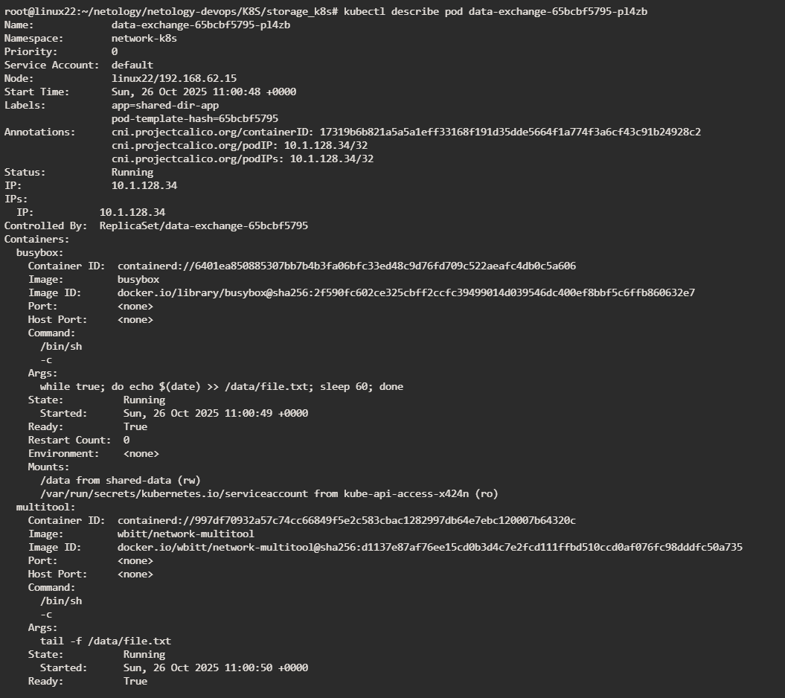
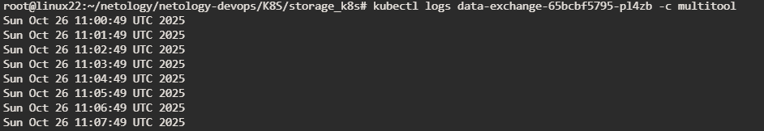
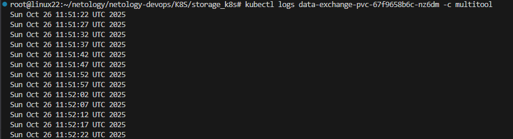
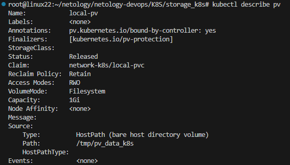
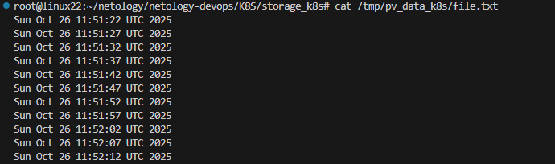
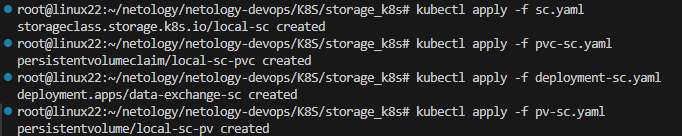
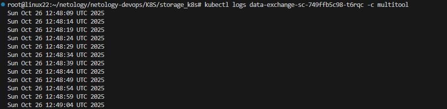

# Задание 1 
### Volume: обмен данными между контейнерами в поде

[Полный вывод describe тут](describe-data-exchange.txt)

### Вывод команды чтения файла

# Задание 2 PV, PVC
### Манифесты pv, pvc

[манифест pv](pv.yaml)

[манифест pvc](pvc.yaml)

### Контейнер multitool может читать данные из файла

### Discribe pv

После удаления Deployment и PVC с установленной политикой восстановления Retain, PV останется на месте и данные в хост-директории не будут удалены.
Данный PV будет находиться в состоянии Released и его нужно будет вручную очистить, чтобы использовать его снова.

### Фаилы остались на ноде

после удаления pv файлы так же остались на диске , так как политика стояла persistentVolumeReclaimPolicy: Retain

# Задание 3 StorageClass
### Манифесты pv, pvc, sc

[манифест pv](pv-sc.yaml)

[манифест pvc](pvc-sc.yaml)

[манифест sc](sc.yaml)

### Скриншоты создания объектов

### Скриншоты результата доступности шареных томов

