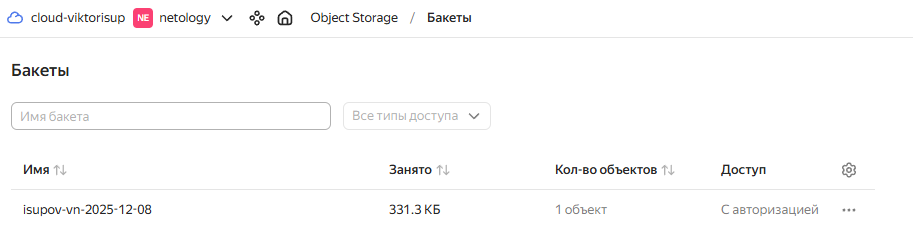
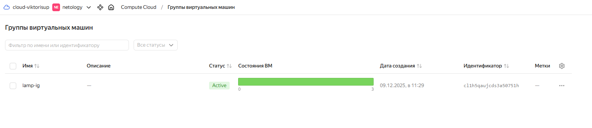
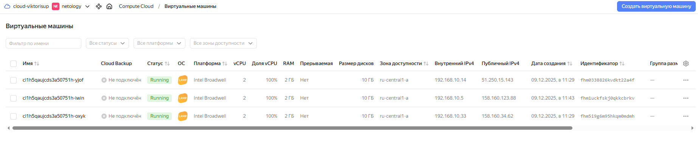
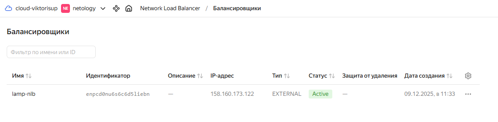

# Домашнее задание к занятию «Вычислительные мощности. Балансировщики нагрузки»

# Задание 1 Yandex Cloud

**Скриншот Object Storage**

**Скриншот Instance Group**

**Скриншот ВМ в группе**

**Скриншот балансировщика**

**Скриншот итогового результата**

